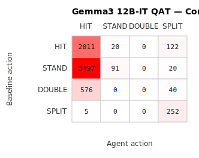

## TL;DR
- I built BlackJackBench: a reproducible Blackjack benchmark with a simulator, baselines, and a policy‑grid that covers all 550 starting positions.
- Key metric is ΔEV vs the basic‑strategy baseline on the exact same seeded hands. With thinking enabled, models approach baseline: Claude Sonnet 4 (ΔEV ≈ −0.01%, 4.0% mistakes), GPT‑5 Nano (medium) (ΔEV ≈ −0.06%, 5.0%), and Gemini 2.5 Flash improves from ΔEV −66.6% (no thinking) to −0.37% with thinking[^2].
- "Perfect" computer play is straightforward; the interesting question is how LLMs compare under fair prompting and strict legality.
- Many models perform poorly (40-80% mistake rates), but thinking-enabled models can match basic strategy accuracy. Everything is seeded, logged, and easy to rerun.

## Why Blackjack
- Simple, well‑understood rules; partially observable; crisp outcomes and ground truth.
- A near‑optimal basic strategy exists, so we can measure decision mistakes and expected value precisely.
- Local decisions (HIT/STAND/DOUBLE/SPLIT) make it easy to isolate and score errors.

## Benchmark Design
- Rules (defaults): 6‑deck shoe, dealer hits soft 17 (H17), Blackjack 3:2, double on any two, double after split (DAS), no surrender, split aces one‑card, resplit to 3 hands.
- Tracks:
  - Policy: Natural dealing. Metrics: EV/hand and mistake rate vs basic strategy.
  - Policy‑grid: 55 two‑card player categories × 10 dealer upcards = 550 cells. Each cell is played once per rep in a fresh env (no carryover). Weighted EV uses natural frequencies.
- Metrics:
  - EV/hand: net units per hand.
  - ev_weighted: natural‑frequency average over the grid.
  - mistake_rate: fraction of decisions that differ from a fixed six-deck, dealer hits soft 17 (H17), double after split (DAS) basic strategy.
- Reproducibility: All runs are seeded; every decision and final outcome is logged as JSONL for replay/audit.

## Methodology: Key Concepts

**Policy-Grid**: Rather than random dealing, we systematically test all 550 possible starting positions (55 two-card player categories × 10 dealer upcards). Each cell gets fresh environment state with no card-counting carryover effects.

**Weighted Expected Value**: Uses natural-frequency weighting based on infinite-deck probabilities. For example, with 6-deck infinite-deck assumptions (4/13 for tens, 1/13 for others):
- P(10,10) = (4/13)^2 and P(dealer Ace) = 1/13, so weight(10,10 vs A) = (4/13)^2 × (1/13) = 16/2197 ≈ 0.00728.
- P(A,2) = 2×(1/13×1/13) and P(dealer 7) = 1/13, so weight(A,2 vs 7) = 2/169 × 1/13 = 2/2197 ≈ 0.00091.
Thus, common states (like tens and dealer tens/Aces) receive higher weight than rare states when computing EV.

**Basic Strategy Baseline**: We compare against fixed 6-deck H17 DAS basic strategy tables. This isn't perfect play (card counting would be better) but represents the established "correct" decision for each situation.

**Mistake Rate**: Simple percentage of decisions that differ from basic strategy baseline, regardless of outcome or severity.

## LLM Integration (Fair and Simple)
- Thinking: Enabling step‑by‑step reasoning (Chain‑of‑Thought‑style) so the model generates intermediate reasoning before returning a one‑word action. We run with “none” or “medium/high” reasoning depending on the experiment.
- Prompt: “rules‑lite” (cards + short rules), no totals/allowed‑actions to avoid hand‑holding.
- Legality guard: If a model proposes an illegal action, we record the violation and substitute an intentionally bad legal fallback via a simple "BadAgent" (e.g., doubles whenever possible, splits tens). This keeps runs going and strongly penalizes non‑compliance; it was rarely triggered in thinking runs[^5].

## Results Summary

The results reveal dramatic performance differences between models, with **thinking capability being the decisive factor**.

Note on reporting: We report ΔEV relative to the empirical Basic Strategy baseline for the exact, seeded 2,750 hands. In this run, Basic Strategy’s absolute EV is +2.6%[^1] due to player‑favorable sampling; ΔEV makes comparisons clearer and fair across models.

| Model                           | ΔEV vs Baseline | Mistake Rate | Decisions |
| :---                            | :-------------: | :----------: | :-------: |
| **Basic Strategy**              | **+0.0%**       | **0.0%**     | —         |
| **GPT‑5 (thinking, medium)**      | **+0.06%**      | **1.2%**     | 4,341     |
| **Claude Sonnet 4 (thinking)**[^3]  | **-0.01%**      | **4.0%**     | 4,281     |
| **GPT‑5 Nano (thinking, medium)**| **-0.06%**      | **5.0%**     | 4,380     |
| **Gemini 2.5 Flash (thinking)**[^2] | **-0.37%**      | **6.0%**     | 4,345     |
| **Gemini 2.5 Pro**[^3]              | **-1.4%**       | **2.1%**     | 4,358     |
| **Claude Opus 4.1 (no thinking)**| **-1.8%**       | **16%**      | 4,422     |
| Claude Sonnet 4 (no thinking)   | -10%            | 36%          | 4,979     |
| Sonoma Sky Alpha                | -15%            | 73%          | 2,669     |
| GPT-5 (no thinking)             | -21%            | 38%          | 4,275     |
| Sonoma Dusk Alpha               | -23%            | 43%          | 4,804     |
| Gemini 2.5 Flash Lite           | -45%            | 62%          | 3,877     |
| GPT‑5 Nano (no thinking)        | -51%            | 55%          | 5,869     |
| Gemini 2.5 Flash (no thinking)  | -67%            | 56%          | 5,825     |
| Gemma3 12B‑IT QAT               | -87%            | 65%          | 6,794     |

**Key Insight**: Four thinking-enabled models (GPT‑5, Claude Sonnet 4, GPT‑5 Nano, and Gemini 2.5 Flash) achieve positive expected value and cannot be statistically distinguished from ideal basic strategy play at the 95% confidence level[^4]. The dramatic performance gap between thinking and non-thinking versions of the same models (e.g., Gemini 2.5 Flash: 66-point EV improvement) reveals that reasoning capability is the decisive factor in strategic game performance.

## GPT-5 Nano: A Case Study in Strategic Inconsistency

GPT‑5 Nano's performance (-48% EV, 55% mistake rate) illustrates how partial knowledge without strategic coherence leads to disaster. The model demonstrates a fascinating paradox: perfect execution of some rules alongside catastrophic violations of others.

**What GPT‑5 Nano got right:**
- **Splitting decisions**: 0% mistake rate—perfect recognition of when to split pairs
- **Basic hit/stand on obvious situations**: Reasonable performance on clear-cut decisions

**Where it went disastrously wrong:**
- **Splitting 10,10 vs dealer 10**: The single worst possible blackjack mistake (7.0% weighted impact)
- **Hitting hard 17+ vs strong dealers**: Fundamental strategic violation 
- **Doubling conservatism**: 99% mistake rate on doubles, missing nearly every profitable opportunity
- **Standing inconsistency**: 73% mistake rate, often standing when should hit

This pattern suggests GPT‑5 Nano has memorized some blackjack "rules" (like split A/A and 8/8) but lacks the strategic framework to apply them consistently. The result is worse than random play—systematic errors that compound losses. The model's perfect split recognition makes its other failures even more puzzling, highlighting how LLMs can exhibit highly uneven competence across related tasks.

## What Models "Know" About Blackjack

Before running expensive benchmarks, I asked models about their blackjack knowledge. You can read their detailed responses in the [model_thoughts/](model_thoughts/) directory, but here are the key patterns:

**Rule Assumptions**: Most models assumed S17 (dealer stands on soft 17), 6-8 decks, 3:2 payouts, DAS enabled, no surrender. This differs from our H17 setup, but the fundamental strategies remain similar.

**Strategic Knowledge**: There was broad agreement on core principles: don't take insurance, always split A/A and 8/8, never split 10/10, stand on hard 17+. Models showed varying sophistication on doubling decisions.

**Model-Specific Insights**:
- **Gemini 2.5 Pro/Flash**: Technically consistent basic strategy guidance with Google Search grounding
- **Claude Sonnet 4/Opus 4.1**: Accurate hard/soft/pairs advice with clean double heuristics  
- **GPT-5/5 Nano**: Solid basic strategy, with GPT-5 adding surrender and Hi-Lo deviations
- **Sonoma Sky/Dusk Alpha**: Strong community consensus that these are cloaked xAI Grok variants (Sky = smarter, Dusk = faster). See, for example, this discussion[^6].
- **Gemma**: Inconsistent rules and a critical error: "double down on soft 19-21"

**The knowledge gap doesn't explain performance differences** - even models with solid theoretical understanding failed dramatically in practice without thinking enabled. This contrasts curiosly with skilled human players, who play perfect basic strategy without "thinking" about blackjack because they have it memorized before they get to a table, making the thinking requirement for LLMs all the more notable.

## The Computational Cost of Strategy: A Decision Complexity Hierarchy

Our analysis of thinking tokens reveals a natural hierarchy of decision complexity that correlates strongly with both mistake rates and computational cost:

### **Trivial Decisions (150-200 tokens)**
- **Pair A/A split**: 167 tokens (Gemini Flash) - Universal agreement, instant recognition
- **Hard 11 vs 3-6**: ~180 tokens - Clear doubling opportunities  
- **Soft 20 stand**: 108 tokens (Claude) - Obvious optimal play

### **Simple Decisions (200-500 tokens)**
- **Hard 17-21**: 133-136 tokens - Clear standing situations
- **Hard 7-10 vs weak dealers**: 200-300 tokens - Straightforward hitting/doubling
- **Most basic strategy "textbook" cases**: Median ~267 tokens (Claude), ~496 tokens (Gemini)

### **Complex Decisions (500-1500 tokens)**  
- **Soft hands vs specific dealers**: 1400-1600 tokens - Requires Ace valuation logic
- **Marginal pairs (7/7, 3/3) vs strong dealers**: 1400-1600 tokens
- **Hard 13-16 vs marginal dealers**: 600-900 tokens - Risk/reward calculations

### **Expert-Level Decisions (1500+ tokens)**
- **Pair 9/9 vs 8**: 8,191 tokens! - The most complex decision in our dataset
- **Soft 18 edge cases**: 1600-1900 tokens - Multiple valid strategies depending on exact situation
- **Hard 14 vs Ace**: 1,070 tokens - Requires understanding dealer bust probabilities

**Key Insight**: The 48x difference between simplest (167 tokens) and most complex (8,191 tokens) decisions reveals that blackjack isn't uniformly difficult—it has distinct complexity tiers that even thinking-enabled models struggle with differently.

## Key Findings

- Ceiling effect at the top: With thinking enabled, frontier models are effectively at the basic‑strategy ceiling. They are statistically indistinguishable from the baseline on this benchmark, indicating that Blackjack basic strategy is solved for these systems. This motivates dynamic benchmarks (e.g., card counting) that require adaptation and memory rather than static decision tables.
- System 1 vs System 2: Current LLMs often require explicit, slow “System 2” reasoning to reliably apply knowledge that human experts internalize as fast “System 1” responses. True mastery will mean executing known strategies without the computational overhead of explicit reasoning.
- The reasoning tax: Deliberate reasoning is powerful but costly. When a cheap, specialized solution exists (e.g., a lookup table), paying the LLM “reasoning tax” is economically irrational for that task. LLM value shines in novel or changing domains where bespoke solutions can’t keep up.
- Mistake cost > mistake count: Sky Alpha demonstrates that error frequency can diverge from performance loss. Benchmarks should capture the cost of errors, not just their quantity, because a few catastrophic errors can dominate many small ones.

## Category-Specific Performance Patterns

### **Hard Hands: The Fundamental Test**
Empirically, hard‑hand rows account for most of the remaining, high‑impact mistakes that separate thinking models. See the Appendix “Top Weighted Mistakes” tables and confusion matrices: across Claude Sonnet 4, Gemini 2.5 Flash, and GPT‑5 Nano (thinking), the largest weighted leaks cluster in hard totals (stiff 12–16 vs specific dealer upcards, and the double bands 9–11). GPT‑5 (medium) simply has very few leaks overall.

Why might models keep misplaying stiff hands? Likely contributors include:
- Steep decision boundaries: HIT↔STAND flips at 12–16 depend tightly on dealer upcard; small biases (always‑hit or always‑stand) create systematic, high‑cost errors.
- Miscalibrated dealer strength: Under/over‑weighting 2–6 vs 7–A leads to classic errors (e.g., hard 12 vs 4; hard 15–16 vs 10).
- Risk/variance aversion on doubles: Hard 9–11 doubles are high‑leverage; models occasionally avoid doubling (or over‑double in the wrong spots) despite large EV swings.

By contrast, soft hands and pairs are more rule‑like and forgiving: soft totals can draw without busting (lower error cost), and pair rules (A/A, 8/8) are near‑deterministic. The Appendix tables reflect this—most pair and many soft rows are already near‑perfect for thinking models.

**Consistent Winners** (Thinking models):
- Hard 17-21: Near-perfect performance (0-0.04% mistake rates)
- Hard 5-8: Universal agreement on hitting
- Hard 12-16 vs weak dealers: Good strategy adherence

**The Breaking Point** - Hard 12-16 vs dealer 10:
- Basic Strategy: 0.0% mistakes
- Claude Sonnet 4 (thinking): 3-5% mistakes  
- Gemini 2.5 Flash (no thinking): 41-67% mistakes
- Gemma3: 51-77% mistakes (catastrophic over-hitting)

### **Pairs: Simple Rules, Complex Execution**
**Universal Success**: A/A and 8/8 splits - even failed models get these right
**Major Differentiator**: 4/4, 5/5, 6/6 pairs
- Thinking models: 4-19% mistake rates
- Non-thinking: 36-100% mistake rates  
- Sky Alpha: 100% (always stands, never splits)

**The 9/9 Anomaly**: Requires the highest computational cost (8,191 tokens) because the decision changes dramatically based on dealer upcard—split vs 2-8, stand vs 7/10/A.

### **Soft Hands: The Advanced Course** 
Most challenging category for all models:
- Even Claude Sonnet 4 (thinking): 8-18% mistake rates on soft doubling
- Gemini models consistently over-double soft hands vs weak dealers
- The Ace valuation problem: models struggle with dual-value (1/11) logic

**Soft 18-19 Edge Cases**: Generate the highest thinking token usage after pair 9/9, indicating these represent true strategic complexity rather than memorizable rules.

## The Thinking Breakthrough: GPT‑5, Claude Sonnet 4, and Gemini 2.5 Flash

The most striking finding is how thinking transforms the same underlying models. In our results, GPT‑5 (medium reasoning) edges out others by EV with the lowest mistake rate among thinking models, while Claude Sonnet 4 and Gemini 2.5 Flash also deliver near‑basic strategy performance:

### Claude Sonnet 4: Near‑Perfect Performance
- With Thinking: ΔEV −0.01%, 4.0% mistake rate (4,281 decisions) — matches baseline within noise
- Without Thinking: ΔEV −10%, 36% mistake rate (4,979 decisions)  
- Net Impact: ~+10 percentage point ΔEV improvement, 32.1 point mistake reduction

### Gemini 2.5 Flash: Dramatic Transformation  
- With Thinking: ΔEV −0.37%, 6.0% mistake rate (4,345 decisions)
- Without Thinking: ΔEV −66.6%, 56% mistake rate (5,825 decisions)
- Net Impact: +66.2 percentage point ΔEV improvement

### GPT‑5 Nano (Medium Thinking): Near‑Basic Strategy
- ΔEV vs baseline: −0.06%
- Mistake rate: 5.0% over 4,380 decisions; 2,750 hands; full 550‑cell coverage
- Confusion hotspots (first decision only):
  - hard 13–16 vs dealer 2–3: chooses HIT instead of correct STAND
  - soft 15–17 vs dealer 3–4: over‑DOUBLING where HIT is correct
  - occasional hard 10 vs 10 over‑DOUBLE

Confusion summary: STAND→HIT dominates the errors (row mistake rate ~7.5%), while DOUBLE and SPLIT rows are very accurate (≤2%). The top‑weighted leaks concentrate in stiff‑hand stands vs weak dealer upcards, matching the patterns in the Appendix tables.

### What Thinking Fixes (Both Models)
- **Perfect Fundamental Decisions**: A/A and 8/8 splits, standing on 19-21
- **Strategic Consistency**: Fewer random or contradictory actions  
- **Complex Situation Handling**: Better doubling and splitting decisions

### Remaining Gaps (Even With Thinking)
**Claude Sonnet 4**: Minor over-doubling on soft hands vs weak dealer cards

**Gemini 2.5 Flash**: Over-doubling soft totals, under-doubling soft 19 vs 6

### Residual Leaks (Thinking Models)
- Soft hands dominate remaining errors across GPT‑5, Claude, Gemini, and GPT‑5 Nano:
  - soft 17–18 vs 2–4: frequent over‑doubling (baseline HIT/STAND → agent DOUBLE)
  - soft 15–16 vs 4: HIT → DOUBLE leakage
  - occasional soft 18 vs 8: STAND → HIT
- Stiff hands are nearly clean; the main outlier is rare hard 12 vs 4: STAND → HIT.
- Hard low totals show minor eagerness to double (e.g., hard 8 vs 5/6: HIT → DOUBLE) but with very small impact.
- Double and split rows are essentially perfect for GPT‑5; pair play (A/A, 8/8, 10/10) is consistently correct across all thinking models.

### Anthropic Without Thinking: Best‑in‑Class Baseline

Across the non‑thinking tier, Anthropic’s models are clearly the strongest. Claude Opus 4.1 (no thinking) lands at roughly ΔEV −1.8% with a 16% mistake rate over 4,422 decisions, and Claude Sonnet 4 (no thinking) leads the rest of the no‑thinking pack at ΔEV −10%. In contrast, other non‑thinking models range from −15% to −87% ΔEV with far higher mistake rates.

Why might Anthropic excel without thinking? Plausible contributors include:
- Strong instruction‑following and rule compliance out‑of‑the‑box (clean one‑word compliance, fewer illegal actions)
- Better priors for basic heuristics (e.g., pairs A/A and 8/8, avoiding catastrophic 10/10 splits)
- More conservative action selection in ambiguous cases (reducing severe error cost)
- Training pipeline emphasis on reliability and adherence to constraints that transfers well to fixed‑rule domains

This makes Anthropic’s models a safer “drop‑in” for constrained, rules‑driven tasks when deliberate reasoning is unavailable or too costly, while thinking remains necessary to reach the full basic‑strategy ceiling.

Given this ceiling effect across leaders, we expect Claude Opus 4.1 with thinking to match the basic‑strategy ceiling as observed for other top models.

### Sample Reasoning Quality
The thinking traces show genuine strategic reasoning: calculating bust probabilities, considering dealer weak cards, referencing basic strategy principles. This isn't memorized responses but actual step-by-step analysis.

### The Imaginary Strategy Card Phenomenon
A particularly interesting pattern emerges from the thinking traces: models frequently consult imaginary "basic strategy charts" or "lookup tables" during their reasoning process. Despite these references being entirely fictional, this simulated consultation proves remarkably effective at producing correct decisions. Rather than purely calculating from first principles, thinking-enabled models often treat basic strategy as an external reference to be consulted—a form of reasoning that bridges pure calculation and pattern lookup.

## Failure Mode Analysis: How Models Break Down

Each model family exhibits distinct error signatures that reveal their underlying reasoning processes:

### **The Gemma3 "Hit Everything" Syndrome**
Confusion Matrix Analysis:
- **Should STAND → Actually HIT**: 3,497 errors (98% of all STAND situations)
- **Should DOUBLE → Actually HIT**: 576 errors (100% of all DOUBLE situations) 
- **Never doubles down**: 0 correct doubles out of 616 opportunities

**Pattern**: Gemma3 has learned "when in doubt, hit" as a default strategy. For blackjack, this is a very poor strategy since standing is frequently the best move and usually not a terrible one.

### **The Sky Alpha "Always Stand" Strategy**  
**Paradoxical Efficiency**: 73% mistake rate but only -13% EV loss

Sonoma Sky Alpha demonstrates a crucial insight about mistake severity in strategic games: error frequency doesn't always correlate with performance loss. Despite making the wrong decision 73% of the time—the second-highest mistake rate in our benchmark—Sky Alpha achieves better expected value than several models with significantly lower error rates.

**Pattern Analysis**:
- **Systematic refusal to hit**: 100% mistake rate on hit decisions for totals 5-11
- **Never splits or doubles**: Treats all decisions as stand/hit binary choices
- **Why it "works"**: Standing is often the least-bad wrong decision

This reveals that not all mistakes are created equal in blackjack—and likely in other strategic domains. Sky Alpha's degenerate "always STAND" strategy, while almost universally wrong, avoids the most catastrophic errors that plague other failed models.

### **Non-Thinking vs Thinking Error Patterns**
**Gemini 2.5 Flash Comparison**:

*Without Thinking*:
- Chaotic error distribution across all categories  
- 56% overall mistake rate
- Major leaks: Splits 10/10 (should stand), refuses to hit 17 vs 10

*With Thinking*:  
- Systematic errors concentrated in edge cases
- 6.0% overall mistake rate  
- Remaining errors: Over‑doubling soft and low hard hands in a few spots (see detailed table below)

**The "Imaginary Strategy Card" Effect**: Thinking models often reference non-existent "basic strategy charts" in their reasoning, yet this hallucinated consultation produces remarkably accurate decisions.

## Failure Mode Summary

**Gemma3**: Exhibits systematic "hit everything" behavior with 97.5% error rate on standing decisions and complete inability to double down (0/616 opportunities). This represents a complete strategic failure where the model defaults to the most aggressive action regardless of situation.

**Non-Thinking Gemini 2.5 Flash**: Shows chaotic error patterns across all decision types, with major leaks including splitting strong pairs (10/10) and over-doubling already strong hands (hard 19). Unlike Gemma3's systematic bias, this represents inconsistent strategic reasoning.

**Detailed breakdown of error patterns and confusion matrices can be found in the Detailed Error Analysis section below.**

## Ensuring Fairness
The goal is to avoid hand‑holding: give only the cards and a short rules blurb and let the model do the rest (compute totals, legality, and choose). That keeps the task “general LLM” rather than a parser exercise.

Rules‑lite prompt (exact text used):

```
Blackjack. Rules: 6 decks, dealer hits soft 17 (H17), blackjack pays 3:2, double on any two, double after split allowed, resplit to 3 hands, split aces one-card, no surrender.
Dealer upcard: {UP}.
Your hand: {RANKS}.
Reply with exactly one word: HIT, STAND, DOUBLE, or SPLIT. No explanations.
```

Where `{UP}` is the dealer’s upcard rank (e.g., 10, A) and `{RANKS}` are the player card ranks (e.g., A,7). No totals or allowed‑action list are provided.

Legality guard: when a model proposes an illegal action for the state, I record the violation and substitute an intentionally bad legal fallback (a “BadAgent” that tends to DOUBLE whenever possible, splits tens, etc.). This keeps runs going and penalizes models that ignore rules.

Coverage and logging:
- The policy‑grid plays every two‑card player category × dealer upcard once per rep in a fresh env, aligns RNG by (cell, rep), and reports a weighted EV using natural starting‑hand frequencies.
- JSONL logs include the observation, chosen action, baseline action, legality metadata, and the final outcome for replay/audit.


## How to Run (Reproducible Examples)
- Baseline sanity:
  - `python -m blackjack_bench.cli run --agent basic --track policy --hands 100000 --seed 7`
- Policy‑grid weighted (basic):
  - `python -m blackjack_bench.cli run --agent basic --track policy-grid --weighted --reps 100 --seed 7`
- LLM example (Gemini API with thinking):
  - `python -m blackjack_bench.cli run --agent llm --guard --llm-provider gemini --llm-model gemini-2.5-flash --reasoning low --track policy-grid --weighted --reps 5 --seed 7`
- LLM example (Anthropic Claude with thinking):
  - `python -m blackjack_bench.cli run --agent llm --guard --llm-provider anthropic --llm-model claude-sonnet-4-20250514 --reasoning low --track policy-grid --weighted --reps 5 --seed 7`
- Inspect confusion (baseline vs agent):
  - `python tools/summarize_confusion.py --track policy-grid logs/<timestamp>_policy-grid_<agent>_<model>.jsonl --csv confusion.csv`

## The Economics of Artificial Reasoning

To accurately assess the “reasoning tax,” account for the actual number of decisions required per hand (DPH). Empirically from the runs here (decisions ÷ 2,750 hands), DPH ≈ 1.56–1.58 for thinking models.

### **Cost-Benefit Analysis (1,000 hands of $10 blackjack; as of 2025/09/12 pricing)**

**API Costs and Decisions per Hand (DPH)**:
- Gemini 2.5 Flash (thinking): $0.0002 per decision; 1.58 DPH
- Claude Sonnet 4 (thinking): $0.0044 per decision; 1.56 DPH
- Basic Strategy lookup table: $0.0000 per decision; 0.00 DPH

**Expected Value (per $10,000 wagered)**:
- Basic Strategy: +$261.30
- Claude Sonnet 4 (thinking): +$260.40
- Gemini 2.5 Flash (thinking): +$223.90

**Net Profit Analysis (EV minus API costs for 1,000 hands)**:
- Basic Strategy: $261.30 profit (no API cost)
- Claude Sonnet 4 (thinking): $253.55 profit (API cost ≈ 1,560 decisions × $0.0044 ≈ $6.85)
- Gemini 2.5 Flash (thinking): $223.58 profit (API cost ≈ 1,580 decisions × $0.0002 ≈ $0.32)

**Key Insight**: For blackjack specifically, the DPH-adjusted “reasoning tax” makes LLMs economically inferior to free lookup tables, even when EV is similar. Pricing differences dominate small EV deltas; as of 2025/09/12, Claude’s higher per‑decision cost reduces profit by ~$6.85 per 1,000 hands versus ~$0.32 for Gemini Flash.

### **When Reasoning Pays Off**
This analysis suggests thinking-enabled LLMs are most valuable for:
1. **Novel rule variants** where lookup tables don't exist
2. **Learning/educational contexts** where understanding the "why" matters  
3. **Multi-game scenarios** where memorizing multiple strategy tables becomes impractical
4. **Real-time adaptation** to rule changes or special conditions

The blackjack benchmark reveals the fundamental economic trade-off of artificial reasoning: sophisticated decision-making capabilities come with computational costs that may not justify the marginal improvements in well-solved domains.

### **Scaling Implications**  
At current API pricing, the crossover point where LLM reasoning becomes cost-effective occurs when:
- Decision complexity exceeds what lookup tables can handle
- The EV improvement from dynamic reasoning exceeds $0.0002-$0.0044 per decision
- The problem domain changes frequently enough that static strategies become obsolete

This suggests that while thinking-enabled LLMs have "solved" basic blackjack, their true value lies in more complex, dynamic strategic environments where memorized solutions are insufficient.

## Future Work
- **Expand Model Coverage**: Test remaining frontier models (GPT-4o, Claude 3.5 Sonnet, etc.)
- **Reasoning Analysis**: Deeper analysis of thinking traces to understand decision-making processes
- **Rule Variant Testing**: Check if mistakes would be optimal under different blackjack rulesets
- **Strategic Consistency**: Compare actual play patterns against models' stated strategies
- **Scale & Engineering**: Sharding, resumption, and caching for large-scale evaluations
- **Card Counting**: Basic blackjack is solved, but can they keep count?

## Conclusion: The Thinking Revolution

**BlackJackBench reveals a fundamental breakthrough**: thinking capability doesn't just improve LLM performance—it transforms models from systematic losers into near-optimal players. The 66-point EV swing between thinking and non-thinking versions of Gemini 2.5 Flash represents the difference between bankruptcy and profitability.

**Key Takeaways**:
- **Thinking is transformative**: The same model architecture produces radically different outcomes based solely on reasoning capability
- **Knowledge ≠ Performance**: Models with solid theoretical understanding still fail without step-by-step reasoning
- **Systematic evaluation matters**: BlackJackBench's policy-grid approach reveals performance patterns invisible in random testing
- **Benchmark ceiling effect**: Basic strategy blackjack may not be challenging enough to distinguish top thinking-enabled models, which all achieve near-optimal performance
- **Reasoning tax matters**: When a cheap, specialized solution exists (e.g., lookup tables), explicit step-by-step reasoning adds cost without improving EV; its value shows in novel or shifting domains.
- **Mistake severity > counts**: Evaluate the cost of errors, not just their frequency—few catastrophic mistakes dominate many small ones.

**The Need for Harder Challenges**: Three models (Claude Sonnet 4, Gemini 2.5 Flash, and Gemini 2.5 Pro) all achieve statistically indistinguishable performance from perfect basic strategy. This suggests that basic blackjack decision-making has become a solved problem for frontier thinking-enabled models. To truly differentiate model capabilities, more complex challenges like card counting—which requires maintaining running counts, true count conversion, and betting strategy adjustments—would provide better discrimination between reasoning systems.

**Implications Beyond Blackjack**: If thinking capability creates such dramatic improvements in a well-defined domain like blackjack, the implications for complex real-world reasoning tasks are profound. However, the ceiling effect observed here also suggests we need more sophisticated benchmarks to push the boundaries of what these systems can achieve.

You can solve Blackjack "perfectly" with a lookup table, but the interesting question is whether general intelligence can discover and apply those solutions through reasoning alone. Ironically, human experts who achieve perfect basic strategy aren't really "thinking" about blackjack either—they've simply memorized the correct decisions cold. The answer, it turns out, depends critically on whether that reasoning process is made explicit. The next frontier lies in challenges that can't be solved by lookup tables alone.

---

<p class="appendix-skip">Prefer to skip? <a href="#after-appendix">Jump past the appendix</a>.</p>
<details class="spoiler" id="appendix" markdown="1">
<summary>Show Appendix: Detailed Error Analysis</summary>

## Appendix: Detailed Error Analysis

### Gemma3 12B-IT QAT: Complete Breakdown

The confusion matrix for Gemma3 reveals a systematic failure pattern where the model defaults to hitting in almost all situations:

**Confusion Matrix (Policy-Grid)**


*Gemma3 confusion matrix showing systematic "hit everything" bias*

| baseline\agent | HIT | STAND | DOUBLE | SPLIT | row_total | row_mistake_rate |
| :--- | ---: | ---: | ---: | ---: | ---: | ---: |
| HIT | 2011 | 20 | 0 | 122 | 2153 | 0.066 |
| STAND | 3497 | 91 | 0 | 20 | 3608 | 0.975 |
| DOUBLE | 576 | 0 | 0 | 40 | 616 | 1.000 |
| SPLIT | 5 | 0 | 0 | 252 | 257 | 0.019 |
| total | 6089 | 111 | 0 | 434 | 6634 | 0.645 |

**Key Patterns**:
- **Should STAND → Actually HIT**: 3,497 errors (97.5% of all STAND situations)  
- **Should DOUBLE → Actually HIT**: 576 errors (100% of all DOUBLE situations)
- **Never doubles down**: 0 correct doubles out of 616 opportunities
- **Pattern**: "When in doubt, hit" strategy—catastrophically wrong for blackjack

**Top Weighted Mistakes**:

| Category | Dealer | Baseline | Agent | Mistakes | Weighted Share |
|---|:---:|:---:|:---:|---:|---:|
| pair 10/10 | 10 | STAND | SPLIT | 5 | 6.46% |
| hard 17 | 10 | STAND | HIT | 10 | 4.04% |
| hard 18 | 10 | STAND | HIT | 5 | 3.23% |
| hard 19 | 10 | STAND | HIT | 5 | 3.23% |
| hard 11 | 10 | DOUBLE | HIT | 20 | 3.23% |
| hard 12 | 4 | STAND | HIT | 20 | 1.41% |
| hard 12 | 5 | STAND | HIT | 20 | 1.41% |
| hard 12 | 6 | STAND | HIT | 20 | 1.41% |

### Gemini 2.5 Flash (Non-Thinking): Chaotic Errors

**Confusion Matrix (Policy-Grid)**

| baseline\agent | HIT | STAND | DOUBLE | SPLIT | row_total | row_mistake_rate |
| :--- | ---: | ---: | ---: | ---: | ---: | ---: |
| HIT   | 1585 | 49  | 62  | 20  | 1716 | 0.076 |
| STAND | 113  | 1681| 0   | 0   | 1794 | 0.063 |
| DOUBLE| 7    | 7   | 564 | 0   | 578  | 0.024 |
| SPLIT | 4    | 0   | 0   | 253 | 257  | 0.016 |
| total | 1709 | 1737| 626 | 273 | 4345 | 0.060 |

**Top EV Leaks (First Decision; Weighted by Natural Frequency)**:

| Category | Dealer | Baseline | Agent | Count | Weighted EV Loss | Share |
|---|:---:|:---:|:---:|---:|---:|---:|
| pair 10/10 | 10 | STAND | SPLIT | 5 | 0.1457 | 7.68% |
| hard 11 | 10 | DOUBLE | HIT | 20 | 0.0728 | 3.84% |
| hard 17 | 10 | STAND | HIT | 10 | 0.0619 | 3.26% |
| hard 18 | 10 | STAND | HIT | 5 | 0.0583 | 3.07% |
| hard 19 | 2 | STAND | DOUBLE | 5 | 0.0546 | 2.88% |
| hard 19 | 6 | STAND | DOUBLE | 5 | 0.0473 | 2.50% |
| hard 19 | 3 | STAND | DOUBLE | 5 | 0.0437 | 2.30% |
| hard 13 | 2 | STAND | HIT | 20 | 0.0401 | 2.11% |
| hard 19 | 5 | STAND | DOUBLE | 5 | 0.0364 | 1.92% |
| hard 15 | 5 | STAND | DOUBLE | 15 | 0.0364 | 1.92% |

**Pattern**: Unlike Gemma3's systematic hitting, non-thinking Gemini Flash shows chaotic error distribution across all decision types, with major mistakes including splitting 10/10 pairs and over-doubling strong hands.

---

### Gemini 2.5 Flash (Thinking): Detailed Breakdown

**Confusion Matrix (Policy-Grid)**

| baseline\agent | HIT | STAND | DOUBLE | SPLIT | row_total | row_mistake_rate |
| :--- | ---: | ---: | ---: | ---: | ---: | ---: |
| HIT   | 1851 | 52  | 62  | 122 | 2087 | 0.113 |
| STAND | 2084 | 310 | 444 | 25  | 2863 | 0.892 |
| DOUBLE| 398  | 12  | 170 | 38  | 618  | 0.725 |
| SPLIT | 0    | 0   | 0   | 257 | 257  | 0.000 |
| total | 4333 | 374 | 676 | 442 | 5825 | 0.556 |

**Top Leaks (First Decision; Weighted by Natural Frequency)**

| Category | Dealer | Baseline | Agent | Count | Weighted EV Loss | Share |
|---|:---:|:---:|:---:|---:|---:|---:|
| hard 10 | 10 | HIT | DOUBLE | 12 | 31.89% |
| pair 5/5 | 10 | HIT | DOUBLE | 5 | 6.64% |
| hard 15 | 2  | STAND | HIT | 9 | 5.98% |
| pair 2/2 | 10 | HIT | SPLIT | 3 | 3.99% |
| soft 14 | 4  | HIT | DOUBLE | 5 | 3.32% |
| soft 16 | 4  | HIT | DOUBLE | 5 | 3.32% |
| soft 17 | 3  | HIT | DOUBLE | 5 | 3.32% |
| soft 17 | 4  | HIT | DOUBLE | 5 | 3.32% |
| soft 19 | 6  | DOUBLE | STAND | 5 | 3.32% |
| hard 10 | A  | HIT | DOUBLE | 5 | 3.32% |
| hard 9  | 2  | HIT | DOUBLE | 5 | 3.32% |
| hard 13 | 2  | STAND | HIT | 5 | 3.32% |

### Claude Sonnet 4 (Thinking): Detailed Breakdown

**Confusion Matrix (Policy-Grid)**

| baseline\agent | HIT | STAND | DOUBLE | SPLIT | row_total | row_mistake_rate |
| :--- | ---: | ---: | ---: | ---: | ---: | ---: |
| HIT   | 1591 | 53  | 63  | 6  | 1713 | 0.071 |
| STAND | 15   | 1718| 1   | 4  | 1738 | 0.012 |
| DOUBLE| 15   | 6   | 552 | 0  | 573  | 0.037 |
| SPLIT | 6    | 0   | 4   | 247| 257  | 0.039 |
| total | 1627 | 1777| 620 | 257| 4281 | 0.040 |

**Top Weighted Mistakes (First Decision)**

| Category | Dealer | Baseline | Agent | Mistakes | Weighted Share |
|---|:---:|:---:|:---:|---:|---:|
| hard 11 | A  | DOUBLE | HIT    | 8  | 6.30% |
| hard 10 | 10 | HIT    | DOUBLE | 2  | 6.30% |
| soft 14 | 3  | HIT    | DOUBLE | 5  | 3.94% |
| soft 17 | 3  | HIT    | DOUBLE | 5  | 3.94% |
| hard 8  | 5  | HIT    | DOUBLE | 5  | 3.94% |
| soft 19 | 6  | DOUBLE | STAND  | 5  | 3.94% |
| hard 8  | 6  | HIT    | DOUBLE | 5  | 3.94% |
| hard 13 | 2  | STAND  | HIT    | 2  | 3.94% |
| hard 9  | 2  | HIT    | DOUBLE | 4  | 3.15% |
| hard 12 | 2  | HIT    | STAND  | 4  | 3.15% |
| soft 15 | 4  | HIT    | DOUBLE | 4  | 3.15% |
| soft 16 | 4  | HIT    | DOUBLE | 4  | 3.15% |

### Claude Sonnet 4 (No Thinking): Detailed Breakdown

**Confusion Matrix (Policy-Grid)**

| baseline\agent | HIT | STAND | DOUBLE | SPLIT | row_total | row_mistake_rate |
| :--- | ---: | ---: | ---: | ---: | ---: | ---: |
| HIT   | 1443 | 125 | 273 | 117 | 1958 | 0.263 |
| STAND | 706  | 1204| 237 | 5   | 2152 | 0.441 |
| DOUBLE| 287  | 5   | 280 | 0   | 612  | 0.542 |
| SPLIT | 0    | 0   | 0   | 257 | 257  | 0.000 |
| total | 2436 | 1334| 790 | 419 | 4979 | 0.361 |

**Top Weighted Mistakes (First Decision)**

| Category | Dealer | Baseline | Agent | Mistakes | Weighted Share |
|---|:---:|:---:|:---:|---:|---:|
| hard 11 | 10 | DOUBLE | HIT    | 20 | 6.87% |
| hard 12 | 5  | STAND  | DOUBLE | 20 | 3.01% |
| hard 13 | 2  | STAND  | HIT    | 20 | 3.01% |
| hard 13 | 3  | STAND  | HIT    | 20 | 3.01% |
| hard 13 | 5  | STAND  | DOUBLE | 20 | 3.01% |
| hard 13 | 6  | STAND  | DOUBLE | 20 | 3.01% |
| hard 14 | 2  | STAND  | HIT    | 15 | 2.58% |
| hard 14 | 3  | STAND  | HIT    | 15 | 2.58% |
| hard 14 | 5  | STAND  | DOUBLE | 15 | 2.58% |
| hard 15 | 5  | STAND  | DOUBLE | 15 | 2.58% |
| soft 16 | 10 | HIT    | DOUBLE | 5  | 1.72% |
| soft 18 | 10 | HIT    | STAND  | 5  | 1.72% |

### GPT‑5 (Medium Thinking): Detailed Breakdown

**Confusion Matrix (Policy-Grid)**

| baseline\agent | HIT | STAND | DOUBLE | SPLIT | row_total | row_mistake_rate |
| :--- | ---: | ---: | ---: | ---: | ---: | ---: |
| HIT   | 1685 | 2   | 28  | 1   | 1716 | 0.018 |
| STAND | 12   | 1774| 7   | 0   | 1793 | 0.011 |
| DOUBLE| 0    | 0   | 575 | 0   | 575  | 0.000 |
| SPLIT | 0    | 0   | 0   | 257 | 257  | 0.000 |
| total | 1697 | 1776| 610 | 258 | 4341 | 0.012 |

**Top Weighted Mistakes (First Decision)**

| Category | Dealer | Baseline | Agent | Mistakes | Weighted Share |
|---|:---:|:---:|:---:|---:|---:|
| hard 12 | 4 | STAND  | HIT    | 3 | 24.74% |
| soft 18 | 2 | STAND  | DOUBLE | 5 | 10.31% |
| soft 17 | 3 | HIT    | DOUBLE | 5 | 10.31% |
| soft 15 | 4 | HIT    | DOUBLE | 5 | 10.31% |
| soft 16 | 4 | HIT    | DOUBLE | 5 | 10.31% |
| soft 17 | 4 | HIT    | DOUBLE | 5 | 10.31% |
| hard 15 | 3 | STAND  | HIT    | 1 | 8.25% |
| hard 8  | 5 | HIT    | DOUBLE | 2 | 4.12% |
| soft 17 | 2 | HIT    | DOUBLE | 1 | 2.06% |
| soft 14 | 4 | HIT    | DOUBLE | 1 | 2.06% |
| hard 8  | 6 | HIT    | DOUBLE | 1 | 2.06% |
| soft 18 | 8 | STAND  | HIT    | 1 | 2.06% |

### GPT‑5 (No Thinking): Detailed Breakdown

**Confusion Matrix (Policy-Grid)**

| baseline\agent | HIT | STAND | DOUBLE | SPLIT | row_total | row_mistake_rate |
| :--- | ---: | ---: | ---: | ---: | ---: | ---: |
| HIT   | 1084 | 160 | 425 | 93  | 1762 | 0.385 |
| STAND | 466  | 825 | 348 | 15  | 1654 | 0.501 |
| DOUBLE| 90   | 30  | 482 | 0   | 602  | 0.199 |
| SPLIT | 2    | 0   | 5   | 250 | 257  | 0.027 |
| total | 1642 | 1015| 1260| 358 | 4275 | 0.382 |

**Top Weighted Mistakes (First Decision)**

| Category | Dealer | Baseline | Agent | Mistakes | Weighted Share |
|---|:---:|:---:|:---:|---:|---:|
| hard 15 | 10 | HIT    | DOUBLE | 4  | 3.92% |
| hard 11 | 10 | DOUBLE | HIT    | 12 | 2.94% |
| hard 13 | 6  | STAND  | DOUBLE | 20 | 2.14% |
| hard 13 | 5  | STAND  | DOUBLE | 19 | 2.08% |
| hard 13 | 3  | STAND  | DOUBLE | 18 | 2.02% |
| hard 13 | 4  | STAND  | DOUBLE | 18 | 2.02% |
| hard 15 | 10 | HIT    | STAND  | 8  | 1.96% |
| hard 14 | 5  | STAND  | DOUBLE | 15 | 1.84% |
| hard 14 | 6  | STAND  | DOUBLE | 15 | 1.84% |
| hard 10 | 10 | HIT    | DOUBLE | 7  | 1.71% |
| hard 14 | 3  | STAND  | DOUBLE | 12 | 1.65% |
| hard 14 | 4  | STAND  | DOUBLE | 12 | 1.65% |

### GPT‑5 Nano (Medium Thinking): Detailed Breakdown

**Confusion Matrix (Policy-Grid)**

| baseline\agent | HIT | STAND | DOUBLE | SPLIT | row_total | row_mistake_rate |
| :--- | ---: | ---: | ---: | ---: | ---: | ---: |
| HIT   | 1652 | 9   | 51  | 9   | 1721 | 0.040 |
| STAND | 134  | 1690| 2   | 1   | 1827 | 0.075 |
| DOUBLE| 1    | 7   | 567 | 0   | 575  | 0.014 |
| SPLIT | 3    | 2   | 0   | 252 | 257  | 0.019 |
| total | 1790 | 1708| 620 | 262 | 4380 | 0.050 |

**Top Weighted Mistakes (First Decision)**

| Category | Dealer | Baseline | Agent | Mistakes | Weighted Share |
|---|:---:|:---:|:---:|---:|---:|
| hard 15 | 2 | STAND  | HIT    | 11 | 11.44% |
| hard 13 | 2 | STAND  | HIT    | 13 | 10.95% |
| hard 16 | 2 | STAND  | HIT    | 5  | 8.46% |
| hard 15 | 3 | STAND  | HIT    | 8  | 8.46% |
| hard 14 | 2 | STAND  | HIT    | 9  | 7.46% |
| hard 10 | 10| HIT    | DOUBLE | 3  | 5.97% |
| hard 13 | 3 | STAND  | HIT    | 6  | 5.97% |
| hard 14 | 3 | STAND  | HIT    | 6  | 2.99% |
| soft 17 | 3 | HIT    | DOUBLE | 5  | 2.49% |
| soft 15 | 4 | HIT    | DOUBLE | 5  | 2.49% |
| soft 16 | 4 | HIT    | DOUBLE | 5  | 2.49% |
| soft 17 | 4 | HIT    | DOUBLE | 5  | 2.5% |

### GPT‑5 Nano (No Thinking): Detailed Breakdown

**Confusion Matrix (Policy-Grid)**

| baseline\agent | HIT | STAND | DOUBLE | SPLIT | row_total | row_mistake_rate |
| :--- | ---: | ---: | ---: | ---: | ---: | ---: |
| HIT   | 1586 | 298 | 20  | 116 | 2020 | 0.215 |
| STAND | 2105 | 814 | 21  | 37  | 2977 | 0.727 |
| DOUBLE| 479  | 94  | 7   | 35  | 615  | 0.989 |
| SPLIT | 0    | 0   | 0   | 257 | 257  | 0.000 |
| total | 4170 | 1206| 48  | 445 | 5869 | 0.546 |

**Top Weighted Mistakes (First Decision)**

| Category | Dealer | Baseline | Agent | Mistakes | Weighted Share |
|---|:---:|:---:|:---:|---:|---:|
| pair 10/10 | 10 | STAND | SPLIT  | 5  | 7.0% |
| hard 17    | 10 | STAND | HIT    | 7  | 3.3% |
| hard 11    | 10 | DOUBLE| HIT    | 16 | 2.8% |
| hard 12    | 10 | HIT   | STAND  | 3  | 1.6% |
| hard 13    | 5  | STAND | HIT    | 19 | 1.5% |
| hard 18    | 10 | STAND | HIT    | 2  | 1.4% |
| hard 19    | 10 | STAND | DOUBLE | 2  | 1.4% |
| hard 19    | 10 | STAND | HIT    | 2  | 1.4% |
| hard 13    | 6  | STAND | HIT    | 14 | 1.3% |
| hard 14    | 4  | STAND | HIT    | 14 | 1.3% |
| hard 12    | 5  | STAND | HIT    | 16 | 1.2% |
| hard 13    | 3  | STAND | HIT    | 15 | 1.2% |

### Gemini 2.5 Pro: Detailed Breakdown

**Confusion Matrix (Policy-Grid)**

| baseline\agent | HIT | STAND | DOUBLE | SPLIT | row_total | row_mistake_rate |
| :--- | ---: | ---: | ---: | ---: | ---: | ---: |
| HIT   | 1687 | 8   | 24  | 2   | 1721 | 0.020 |
| STAND | 40   | 1754| 11  | 1   | 1806 | 0.029 |
| DOUBLE| 2    | 1  | 571 | 0   | 574  | 0.005 |
| SPLIT | 0    | 1  | 0   | 256 | 257  | 0.004 |
| total | 1729 | 1764| 606 | 259 | 4358 | 0.021 |

**Top Weighted Mistakes (First Decision)**

| Category | Dealer | Baseline | Agent | Mistakes | Weighted Share |
|---|:---:|:---:|:---:|---:|---:|
| hard 15 | 2 | STAND  | HIT    | 4 | 16% |
| hard 14 | 2 | STAND  | HIT    | 2 | 13% |
| soft 17 | 3 | HIT    | DOUBLE | 5 | 7.9% |
| soft 15 | 4 | HIT    | DOUBLE | 5 | 7.9% |
| soft 16 | 4 | HIT    | DOUBLE | 5 | 7.9% |
| soft 17 | 4 | HIT    | DOUBLE | 5 | 7.9% |
| hard 13 | 2 | STAND  | HIT    | 4 | 6.3% |
| hard 18 | 9 | STAND  | HIT    | 1 | 6.3% |
| soft 19 | 5 | STAND  | DOUBLE | 3 | 4.7% |
| soft 18 | 2 | STAND  | DOUBLE | 2 | 3.2% |
| soft 19 | 3 | STAND  | DOUBLE | 2 | 3.2% |
| hard 13 | 3 | STAND  | HIT    | 2 | 3.2% |

### Thinking Load Heatmaps (Difficulty by Deliberation)

We aggregate "thinking load" (average characters of llm_thinking text, falling back to output tokens when available) across the four thinking runs (Claude Sonnet 4, Gemini 2.5 Flash, GPT‑5 medium, GPT‑5 Nano medium) and average per starting cell to estimate perceived difficulty. Grids show the average thinking per start — higher numbers indicate harder decisions for models.


*Hard totals grid: rows = hard total, cols = dealer 2–10,A*


*Soft totals grid: rows = soft total, cols = dealer 2–10,A*


*Pairs grid: rows = pairs A/A..10/10, cols = dealer 2–10,A*

Repro: generate the per‑cell table and build charts

- `python tools/aggregate_thinking.py baselines/20250911_policy-grid_llm_gpt-5-med-thinking.jsonl baselines/20250910_policy-grid_llm_claude-sonnet-4-20250514-thinking.jsonl baselines/20250909_policy-grid_llm_gemini-2-5-flash-thinking.jsonl baselines/20250911_policy-grid_llm_gpt-5-nano-med-thinking.jsonl`
- `python tools/build_thinking_charts.py --per-cell figures/thinking_load_by_cell.csv --out-dir figures`

Validation spot‑checks of narrative examples (from the same logs)
- Pair 9/9 vs 8: Gemini Flash out_tokens max 8,191 on a first decision (most complex event observed)
- Soft 20 stand (Claude): min out_tokens 108 across first decisions (very light)
- Hard 11 vs 3–6 (Gemini): min out_tokens 180; median ~362 (simple)
- Soft 18 “edge cases” (Gemini): max out_tokens 1,867; upper tail ~1.4–1.9k (complex)

</details>
<span id="after-appendix"></span>

## Footnotes

[^1]: **Expected Value Methodology**: The +2.6% EV for Basic Strategy represents the empirical result from the specific 2,750 hands tested, not the theoretical house edge (~-0.5% under standard rules). This sample-specific baseline ensures fair comparison since all models play identical hands with identical random seeds. The positive EV indicates this particular sample was player-favorable, which is within normal variance for blackjack.

[^2]: **"Thinking" Definition**: "Thinking" refers to Chain-of-Thought prompting where models generate intermediate reasoning steps before outputting their final decision. For OpenAI models, this uses the reasoning effort parameter; for Anthropic models, this enables the thinking budget; for Google models, this uses reasoning summaries. Non-thinking models respond directly without explicit step-by-step reasoning.

[^3]: **Model Specifications**: Exact model identifiers used: Claude Sonnet 4 (`claude-sonnet-4-20250514`), GPT-5 (`gpt-5`), Gemini 2.5 Flash (`gemini-2.5-flash`). There is strong community consensus that Sonoma Sky/Dusk Alpha models are cloaked xAI Grok variants.

[^4]: **Statistical Confidence**: Wide 95% confidence intervals (e.g., [-4.2%, +5.8%]) reflect the inherent variance in blackjack outcomes. Results are based on 5 repetitions of the 550-cell policy grid (2,750 total hands per model). Significantly more repetitions would be required to achieve tighter confidence bounds for distinguishing top-tier models.

[^5]: **Illegal Move Handling**: The legality guard was rarely triggered across all models tested, with most showing zero illegal attempts. When illegal moves occurred, they were logged and handled by a deliberately bad fallback policy (“BadAgent”) that chooses intentionally poor but legal actions (e.g., doubling whenever possible, splitting tens) to penalize rule violations while allowing benchmark continuation.

[^6]: See, for example, this discussion: https://manifold.markets/iwakura/who-is-behind-the-sonoma-cloaked-mo

<!-- Optional figures/placeholders -->
<!-- Figure: Confusion matrix (baseline vs agent) -->
<!-- Figure: Per-cell EV heatmap (policy-grid, weighted) -->
